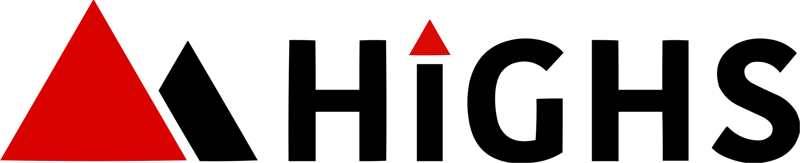

<!-- markdownlint-disable MD013 MD033 -->

# go-highs

**go-highs** provides a Go interface to the HiGHS linear programming solver.

## License

Please note that go-highs is provided as _source-available_ software (not
_open-source_). For further information, please refer to the [LICENSE](./LICENSE)
file.

## Usage

A first run can be done with the following command:

```bash
go run cmd/main.go -runner.input.path cmd/input.json
```

This will run the solver and output the result to the console.

In order to start a _new project_, please refer to the sample app in the
[community-apps repository](https://github.com/nextmv-io/community-apps/tree/develop/knapsack-gosdk).
If you have [Nextmv CLI](https://docs.nextmv.io/docs/platform/installation#nextmv-cli)
installed, you can create a new project with the following command:

```bash
nextmv community clone -a knapsack-gosdk
```

For further information on how to get started, features, deployment, etc.,
please refer to the [official documentation](https://docs.nextmv.io/docs/mixed-integer-programming).
